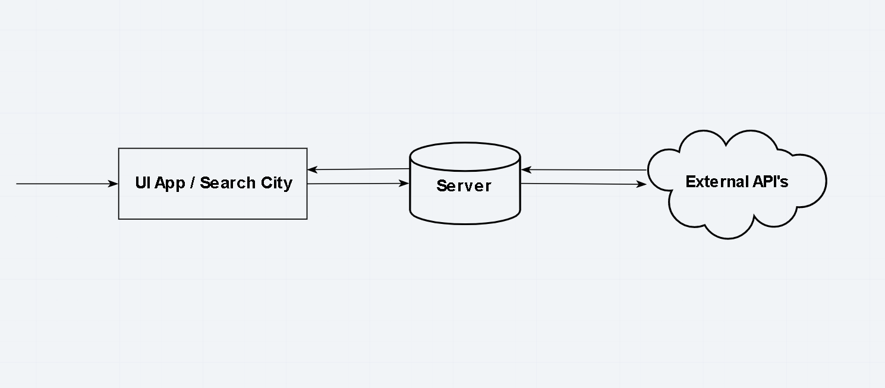

# city-explorer-api
A server for the city explorer web app

**Author**: MuckT
**Version**: 1.0.0

## Overview
A server for the city explorer web app will connect to multiple API's to make requests to and format external response bodies for the front end application.

## Getting Started

1. Install dependencies

  ```bash
  yarn
  ```

2. Run the server

  ```bash
  yarn start
  ```

## Architecture

* [Yarn - Package Manager](https://yarnpkg.com/)

* [Express - Web Framework for Node.js](https://www.npmjs.com/package/express)

* [Node.js](https://nodejs.org/en/)

* [Cypress (testing)](https://www.cypress.io)

## Credit and Collaborations

[MuckT](https://github.com/MuckT)

[ALOYSIOUS](https://github.com/AL0YSI0US)

## Request Diagram



## Tasks to Complete

### Task 1 - Set up your server repository

Estimate of time needed to complete: 1 hour

Start time: 11:00pm

Finish time: 11:30pm

Actual time needed to complete: 30 minutes
